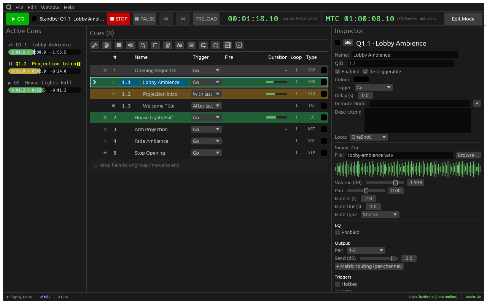

<p align="center">
  
</p>

<h1 align="center">CuePool</h1>

<p align="center">Sound, video, and lighting cues for live shows.</p>

<p align="center">
  <a href="https://bluejaylouche.github.io/cuePool/">User guide</a> ·
  <a href="#getting-started">Getting started</a> ·
  <a href="CONTRIBUTING.md">Contributing</a>
</p>

CuePool is an open-source cue player for macOS, Windows, and Linux.
Build a cue list and step through it with GO, or link cues to run in sequence.



## Features

- **Audio and video** — play sound, video, images, and text from one cue list,
  with fades, loops, and multichannel audio routing.
- **Cue sequencing** — fire cues manually, together, or when the previous cue
  finishes. Use groups and delays to control the sequence.
- **Projection mapping** — map video to multiple outputs with warping
  and edge blending.
- **Lighting** — send DMX over sACN or Art-Net and map video onto LED fixtures.
- **Show control** — use OSC, MIDI, and timecode, or connect through the
  [HTTP API](docs/AUTOMATION.md) and [MCP server](mcp/README.md).

Edit mode is for programming; switch to Show mode to lock cue editing.
Projects are `.qproj` files. Pack a project with its media to take it to another
machine.

## Getting started

Follow the [build instructions](CONTRIBUTING.md#building-from-source) to install
Rust and the platform dependencies, then run from the repository root:

```sh
cargo run --release --locked -p cuepool
```

The [first-show walkthrough](guide/src/getting-started.md#your-first-show) covers
adding a cue, playing it with **Space**, and saving your project.

## Documentation

- [User guide](https://bluejaylouche.github.io/cuePool/) — cue types, audio,
  video, lighting, and show control. Also available [in this repository](guide/src/README.md).
- [Command-line options](guide/src/getting-started.md#command-line-options) —
  open a project at startup and choose the initial mode.
- [Environment variables](docs/ENVIRONMENT.md) — build and runtime settings.
- [Automation API](docs/AUTOMATION.md) — diagnostics, playback commands,
  automation profiles, and Windows playback checks.
- [Pixel feed](docs/PIXEL_FEED.md) — stream pixel-map samples to a visualiser.
- [Build identity](docs/build-identity.md) — source versions, overrides, and
  offline notes in **Help → Changes**.
- [Packaging](packaging/README.md) and [releases](docs/releases.md) — app
  bundles, product changelogs, and publication.

## Contributing

See [CONTRIBUTING.md](CONTRIBUTING.md) for build requirements, checks, and a map
of the codebase. Report bugs or suggest improvements in
[GitHub issues](https://github.com/kovvbojAV/cuePool/issues).

## Credits and license

CuePool began as a Rust port of [QPlayer](https://github.com/space928/QPlayer)
by space928 and was renamed to avoid confusion with the original project.
It is now a standalone workspace, extracted from
[rustjay-engine](https://github.com/BlueJayLouche/rustjay-engine), and uses
`rustjay-lighting` (MIT) from crates.io.

Licensed under [Apache 2.0](LICENSE-APACHE) or [MIT](LICENSE-MIT), at your option.
Unless you explicitly state otherwise, contributions intentionally submitted for
inclusion are dual licensed under the same terms, without additional conditions.
